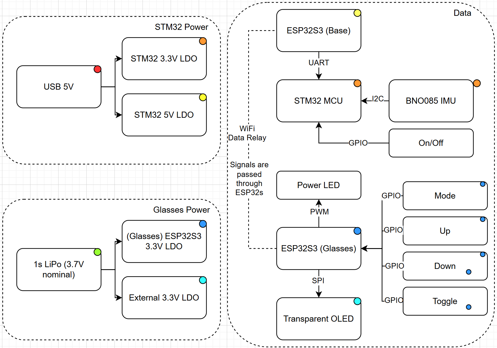

# Final Project

**Team Number: Team 15**

**Team Name: Argus**

| Team Member Name | Email Address          |
| ---------------- | ---------------------- |
| Seth Lee         | sethlee@seas.upenn.edu |
| Jerry Zhang      | jerryjz@seas.upenn.edu |
| Thomas Liu       | tholiu@seas.upenn.edu  |

**GitHub Repository URL: https://github.com/upenn-embedded/final-project-s26-t15.git**

**GitHub Pages Website URL:** [for final submission]*

## Final Project Proposal

### 1. Abstract

Our final project (Argus) is a pair of augmented reality glasses that utilizes a HUD and sensor suite to collect and display movement information along with live timers that always keep the user up to date with their activities. Using a STM32 MCU and XIAO ESP32S3 processors, we can wirelessly transmit data from the glasses to our pocket. Featuring a transparent OLED for the HUD, 9-axis IMU for spatial tracking, and capacitive touch sensors, we combine portability with performance. The ESP32s will relay data wirelessly from the glasses to the STM32 in the user's pocket which serves as the compute hub.

### 2. Motivation

Argus helps bridge the gap between physical activity and real-time data accessibility without sacrificing situational awareness. While commercial AR glasses often prioritize complex media ecosystems and overlays, Argus focuses on lightweight, purpose-focused architecture that offloads heavy processing to a pocket-based STM32 to minimize weight. The sensors then provide a distraction-free, hands-free HUD for users. Instead of having to look at a watch or pull out a phone, users can find relevant telemetry in their line of sight. The emphasis on power efficiency and simplicity makes it perfect for tasks like checking the direction of travel while running or biking, where looking down could be unsafe. We hope that this project can provide a base for more advanced sensors and features.

### 3. System Block Diagram

### 4. Design Sketches

### 5. Software Requirements Specification (SRS)

**5.1 Definitions, Abbreviations**

STM32 - STM32F411RE microcontroller on the NUCLEO-F411RE development board.

Base ESP32 - the ESP32 module connected to the STM32 via UART.

Glasses ESP32 - The ESP32 module mounted on the glasses frame. Receives data from the Base ESP32 and interacts with peripherals.

IMU - Inertial Measurement Unit. Accelerator/gyroscope sensor for step detection.

**5.2 Functionality**

| ID     | Description                                                                                                                                                                                              |
| ------ | -------------------------------------------------------------------------------------------------------------------------------------------------------------------------------------------------------- |
| SRS-01 | The STM32 shall read the IMU accelerometer data over I2C at a minimum rate of 50 Hz to enable accurate step detection.                                                                                   |
| SRS-02 | The step detection algorithm shall detect a walking step within 400ms of it occuring, with no more than 10% error over a 20-step walk test.                                                             |
| SRS-03 | The display shall update its shown content within 500ms of a button press. This includes the full round-trip: glasses ESP32 → base ESP32 → STM32 → base ESP32 → glasses ESP32 → display.            |
| SRS-04 | The STM32 shall synchronize its RTC with NTP time via the base ESP32 over UART once at startup.                                                                                                         |
| SRS-05 | The display shall cycle through atleast three different modes: time view, step count view, and compass view.                                                                                             |
| SRS-06 | The STM32 shall receive and process data from the base ESP32 over UART within 100ms of transmission.                                                                                                     |
| SRS-07 | The STM32 shall compute the compass direction from the magnetometer data from the IMU and display cardinal direction (N, NE, E, SE, S, SW, W, NW) accurate to within +/- 22.5 degrees after calibration. |

### 6. Hardware Requirements Specification (HRS)

**6.1 Definitions, Abbreviations**

See Section 5.1 for all definitions and abbreviations.

**6.2 Functionality**

| ID     | Description                                                                                                                                                                                                           |
| ------ | --------------------------------------------------------------------------------------------------------------------------------------------------------------------------------------------------------------------- |
| HRS-01 | The system shall use an IMU with atleast 3-axis accelerometer, 3-axis gyroscope, and 3-axis magnetometer capabilities, communicating over I2C, to provide motion data for step-count and compass data for direction. |
| HRS-02 | The display shall be smaller enough to mount on glasses frames and support atleast two lines of text output.                                                                                                          |
| HRS-03 | A push button shall be mounted on the glasses frame and be able to register a press within 100ms of acutuation.                                                                                                       |
| HRS-04 | Two ESP32 modules shall be able to maintain wireless connection with a round-trip latency of less than 500ms within 5m of distance.                                                                                   |
| HRS-05 | The STM32 shall communicate with the base ESP32 over UART at a baud rate of atleast 9600 bps.                                                                                                                         |
| HRS-06 | The glasses shall be powered by a battery capable of powering the glasses for atleast 30 minutes continuously.                                                                                                        |

### 7. Bill of Materials (BOM)

### 8. Final Demo Goals

On Demo day, the smart glasses will be demonstrated by having someone wear them. The STM32 with its base ESP32 will have remain close by when the user is using the smart glasses to reduce latency and improve connectivity between the two ESP32 modules.

### 9. Sprint Planning

| Milestone  | Functionality Achieved                                                                                                                                                                                                                                                                                                                            | Distribution of Work                                                                        |
| ---------- | ------------------------------------------------------------------------------------------------------------------------------------------------------------------------------------------------------------------------------------------------------------------------------------------------------------------------------------------------- | ------------------------------------------------------------------------------------------- |
| Sprint #1  | 1] Get individual components to connect to each other, i.e STM32 and ESP32. 2] Verify UART connection between STM32 and ESP32, wifi-connection, and confirm that STM32 can recieve button press. 3] Begin prototyping glasses frame + begin calibrating screen for close-up view. 4] synchronize RTC time with NTP time via wifi. | Seth - Firmware Jerry - Display + Firmware Thomas - Glasses Frame                 |
| Sprint #2  | 1] Get STM32 to receive IMU data over I2C and display steps / compass direction 2] Get display to show text/time. 3] Finalize power source for the glasses display + ESP32. 4] Finalize Glasses Frame and test it for proper fitting/balance.                                                                                      | Seth - Firmware Jerry - Display + Peripheral Integration Thomas - Glasses Frame  |
| MVP Demo   | 1] Get steps algorithm and compass direction working. 2] Fully integrate ESP32 and display onto glasses frame. 3] Ensure that calibration + synchronizing of RTC time work as expected.                                                                                                                                                 | Seth - Firmware Jerry - Peripheral Integration + Calibration Thomas - Integration |
| Final Demo | Ensure that final product is fully functional and meets requirements.                                                                                                                                                                                                                                                                             |                                                                                             |

**This is the end of the Project Proposal section. The remaining sections will be filled out based on the milestone schedule.**

## Sprint Review #1

### Last week's progress

### Current state of project

### Next week's plan

## Sprint Review #2

### Last week's progress

### Current state of project

### Next week's plan

## MVP Demo

## Final Report

Don't forget to make the GitHub pages public website!
If you’ve never made a GitHub pages website before, you can follow this webpage (though, substitute your final project repository for the GitHub username one in the quickstart guide):  [https://docs.github.com/en/pages/quickstart](https://docs.github.com/en/pages/quickstart)

### 1. Video

### 2. Images

### 3. Results

#### 3.1 Software Requirements Specification (SRS) Results

| ID     | Description                                                                                               | Validation Outcome                                                                          |
| ------ | --------------------------------------------------------------------------------------------------------- | ------------------------------------------------------------------------------------------- |
| SRS-01 | The IMU 3-axis acceleration will be measured with 16-bit depth every 100 milliseconds +/-10 milliseconds. | Confirmed, logged output from the MCU is saved to "validation" folder in GitHub repository. |

#### 3.2 Hardware Requirements Specification (HRS) Results

| ID     | Description                                                                                                                        | Validation Outcome                                                                                                      |
| ------ | ---------------------------------------------------------------------------------------------------------------------------------- | ----------------------------------------------------------------------------------------------------------------------- |
| HRS-01 | A distance sensor shall be used for obstacle detection. The sensor shall detect obstacles at a maximum distance of at least 10 cm. | Confirmed, sensed obstacles up to 15cm. Video in "validation" folder, shows tape measure and logged output to terminal. |
|        |                                                                                                                                    |                                                                                                                         |

### 4. Conclusion

## References
